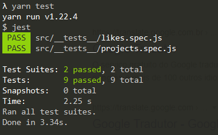

<p align="center">
  <a href="#rocket-tecnologias">Tecnologias</a>&nbsp;&nbsp;&nbsp;|&nbsp;&nbsp;&nbsp;
  <a href="#-projeto">Projeto</a>&nbsp;&nbsp;&nbsp;|&nbsp;&nbsp;&nbsp;
  <a href="#-como-rodar">Como rodar</a>&nbsp;&nbsp;&nbsp;|&nbsp;&nbsp;&nbsp;
  <a href="#-Rotas">Rotas</a>&nbsp;&nbsp;&nbsp;|&nbsp;&nbsp;&nbsp;
  <a href="#-como-contribuir">Como contribuir</a>&nbsp;&nbsp;&nbsp;
</p>

<br>


## Ignite Node.js - Terceiro desafio

## 🚀 Tecnologias

Esse projeto foi desenvolvido com as seguintes tecnologias:

- [NodeJS](https://nodejs.org/en/) - 0.63.3
- [Yarn](https://yarnpkg.com/) - 1.22.4
- [Npm](https://www.npmjs.com/) - 6.14.5


## 💻 Projeto

API para cadastra usuario e fazer o CRUD de tarefas.

Descrição do desafio [Ignite](https://www.notion.so/Desafio-03-Corrigindo-o-c-digo-c15c8a2e212846039a367cc7b763c6dd)


Resolulção do teste.
<p align="center">
  
</p>

## 🚀 Como Rodar

- Clone o projeto.
- Entre na pasta do projeto e rode "yarn install" (pode usar npm install de acordo com a sua configuração).
- "yarn test" para rodar os testes.
- yarn run dev para rodar o projeto (localhost:3333).

## 👩🏿‍💻 Rotas

- **`POST /repositories`**: Rota para cadastro de repositorios.

Enviar:
```
{
    "name": "João",
    "username": "joao"
}
```
Retorna:
```
{
	id: "c160a99b-9d3b-4669-8a35-8dce1e8196ec",
	title: "Umbriel",
	techs: ["React", "ReactNative", "TypeScript", "ContextApi"],
	url: "https://github.com/Rocketseat/umbriel",
	likes: 0
}
```

- **`GET /repositories`**: Rota para retornar todos os repositorios.

Retorna:
```
[
    {
        id: "c160a99b-9d3b-4669-8a35-8dce1e8196ec",
        title: "Umbriel",
        techs: ["React", "ReactNative", "TypeScript", "ContextApi"],
        url: "https://github.com/Rocketseat/umbriel",
        likes: 0
    }
]

```

- **`POST /repositories/:id/likes`**: Rota para somar um like no repositorio.

Retorna:
```
{
    id: "c160a99b-9d3b-4669-8a35-8dce1e8196ec",
    title: "Umbriel",
    techs: ["React", "ReactNative", "TypeScript", "ContextApi"],
    url: "https://github.com/Rocketseat/umbriel",
    likes: 1
}
```

- **`PUT /repositories/:id`**: Rota para alterar um repositorio.

Enviar:
```
{
        title: "Umbriel alteradao",
        techs: ["React", "ReactNative", "TypeScript", "ContextApi"],
        url: "https://github.com/Rocketseat/umbriel",
        likes: 1
}
```

Retorna:
```
{
        title: "Umbriel alteradao",
        techs: ["React", "ReactNative", "TypeScript", "ContextApi"],
        url: "https://github.com/Rocketseat/umbriel",
        likes: 1
}
```

- **`DELETE /repositories/:id`**: Rota para deletar um repositorio.


## 🤔 Como contribuir

- Faça um fork desse repositório;
- Cria uma branch com a sua feature: `git checkout -b minha-feature`;
- Faça commit das suas alterações: `git commit -m 'feat: Minha nova feature'`;
- Faça push para a sua branch: `git push origin minha-feature`.

Depois que o merge da sua pull request for feito, você pode deletar a sua branch.

## 📝 Licença

Esse projeto está sob a licença MIT.
